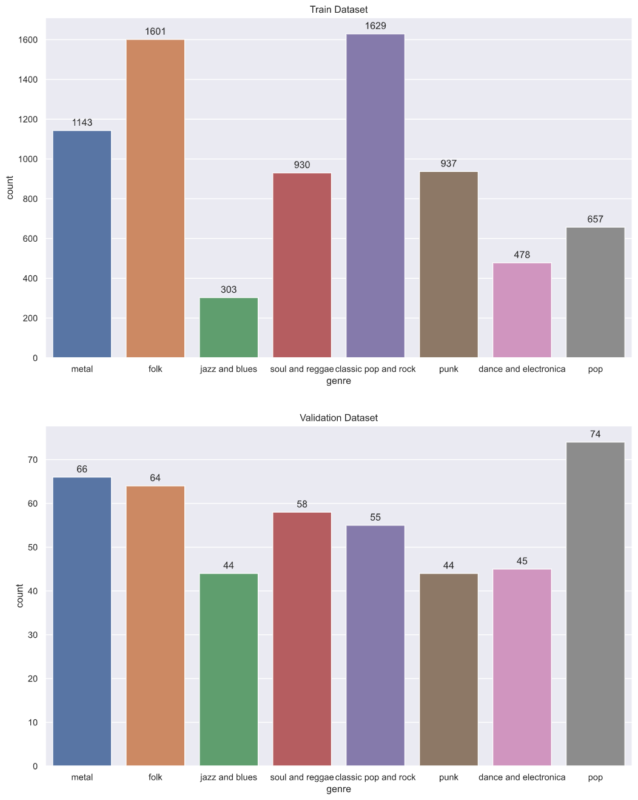
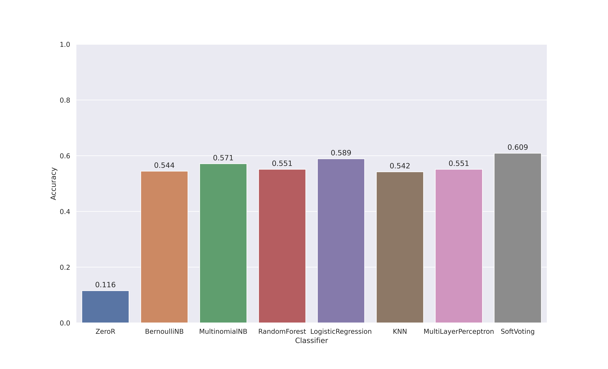
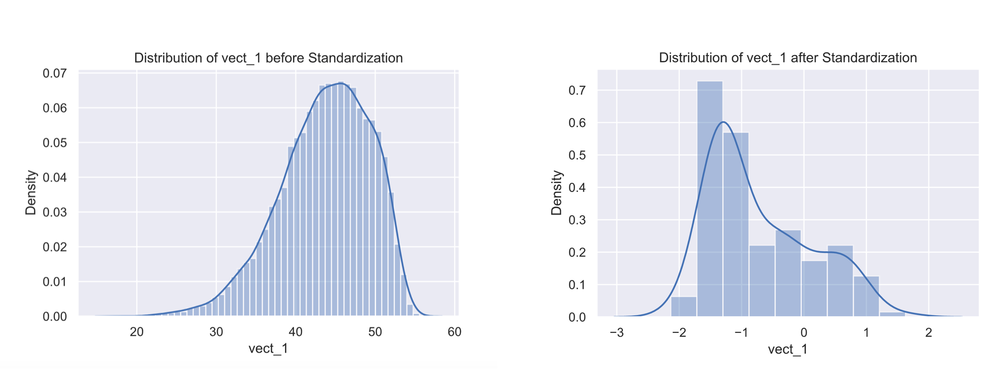
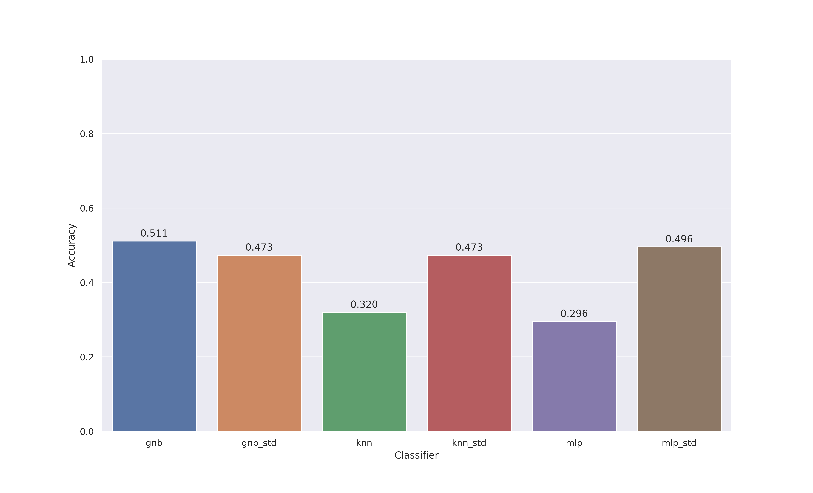

## Report

### 1. Introduction

Nowadays, people have instant access to the terabytes of musical content via Internet and there are thousands of musics are published on music streaming platforms like Spotify, Apple Music and NetEase Music. Music can be categorised by its style and music genres are such categorical labels.  These labels are related to the instrumentalization, rhythmic structure and harmonic content of the music.$[1]^{Automatic Music Genre Classification Using Ensemble of Classifiers}$  Music genre is widely used and understood by people. People usually search musics by using music genre as keyword. And music genre is also essential for music streaming platforms making music collections and recommendation for users.

Traditionally, the music genres are labeled by human musical experts. However, human perception of music is dependent on a variety of personal, cultural and emotional aspects. Therefore its genre classification results may avoid clear definition and the boundaries among genres are fuzzy.$[2]^{Musical Genre Classification Using Ensemble of Classifiers}$  

The task of this report is attempt to build some supervised learning algorithms to automatically identify  music genre with given dataset, and critically analyse the performance of these algorithms. Firstly, we explored the dataset and aimed to understand the relationship amogst features and the relationship between features and labels. Then, we decided to set up two models and develop multiple algorithms respectively  to have automatic music genre classification. One is to extract lyrics as the feature vector, and the other is to extract all numeric features as new feature vectors. We  also analysed the relative advantages and disadvantages of each of the methods and finally reported our observations.

### 2.Related Work

Holistically there were two sides of the music genre classification problem tackled by researchers; one side looked at lyrics of songs and constructed a model that would translate this into a genre, and one side looked at MFCC to create predictions.$[3]^{Using Song Lyrics and Frequency to Predict Genre}$

Berton et al$[4]^{Berton, Thomas. Importance of instrumentals, vocals and lyrics in music emotion classification : based on random forest and logistic regression. Ecole polytechnique de Louvain, Université catholique de Louvain, 2019. Prom. : Delvenne, Jean-Charles ; Saerens, Marco. http://hdl.handle.net/2078.1/thesis:21981}$ used Radom Forest and Logistic Regression to make multiclass music emotion prediction. They found that Logistic Regression outperforms the Radom Forest for the lyrics analysis. Yunjing An et al $[5]^{Y. An, S. Sun and S. Wang, "Naive Bayes classifiers for music emotion classification based on lyrics," *2017 IEEE/ACIS 16th International Conference on Computer and Information Science (ICIS)*, Wuhan, 2017, pp. 635-638, doi: 10.1109/ICIS.2017.7960070.}$ used Naive Bayes algorithm to make Chinese music emotion classification and their model achieved accuracy of 68%. Jayen Ram et al$[6]^{Using Song Lyrics and Frequency to Predict Genre}$ used Naive Bayes, SVM to make lyrics-based music genre classification and used Neural Network to make prediction based on the frequency of th song, achieving accuracy of 88.5%, 88.2% and 95.6% respectively.  Carlos N. Silla Jr. et al $[7]^{Automatic Music Genre Classification Using Ensemble of Classifiers}$proposed ensemble of classifiers. They combined the outputs provided by each individual classifier such as SVM, Naive Bayes and MLP  through simple combination rules such as majority vote, max, sum and product rules.  And they found the improvement in accuracy ranges from 1% to 7%.

### 3. Dataset

#### 3.1 Data Analysis

Dataset is divided into two parts, one is features of songs, the other is labels of songs. The structure of features is track ID/title/tags/loudness/tempo/time signature/key/mode/duration and 148 columns containing pre-computed audio features of each song. And the structure of labels is corresponded track ID and genre.

After we analysed the label datasets, we found that the distributions of genres in test dataset and validation dataset are different. Summatization shown in Figure 1. There is imbalance data distribution in test dataset; from Figure 1, we can see that in train dataset Jazz and Blues and Dance and Electronica are well below the mean, while Folk and Classic Pop and Rock are dominant in amount. And the data in validation dataset is in a relatively uniform distribution which is different from training dataset.

Figure 1: Analysis of data distribution in label dataset 

### 4. APPROACHES

We have taken two models to the problem. In our first model, we use text features (i.e. lyrics of songs) as our feature vector, and the genres as labels to identify. We implemented Bernoulli Naive Bayes, Multinomial Naive Bayes, Logistic Regression, Random Forest, MultiLayper Perceptron, KNN and Voting to classify musics into different genres. In our second model, we extracted numerical features as our feature vector and use it to identify the genre. We developed Gaussian Naive Bayes and KNN in this model. 

#### 4.1 Model I: Lyrics-based Classification 

##### 4.1.1 Preprocess

The tags , representing some words appeared in the lyrics of the songs, are stored in a list of comma-seperated strings. In the preprocessing phase, we decided to have a text retrieval procedures for tags. Therefore, each unique item in tag is regarded as a feature. There are two approaches to describe the occurence of word within a document. One simple approch is to count the word frequency in the whole lyrics collection, using `CounterVectorizer` in `sklearn`. Another approch is assigning a weight factore to each term in lyrics collection to reflect how important a word is, such as tf-idf, short for term frequency-inverse document frequency. Here, we use `TfdifVectorizer` in `sklearn` to implement tf-idf term weighting model. In this model, the tf-idf of a word in tags is computed as 

$$
\begin{align}

\text{tf-idf(t,d)} &=\text{tf(t,d)} \times \text{idf(t)}

\\

\text{idf}(t) &= \log{\frac{1 + n}{1+\text{df}(t)}} + 1

\end{align}
$$

, where $t$ is represented as term (i.e. the word), $n$ is the total number of tags in tag set, and ${\rm df}(t)$is the number of tags in the tag set that contain term $t^{[1]( https://scikit-learn.org/stable/modules/feature_extraction.html)}$ .  After having a glance at tags, we obeserved that there are some words repeatedly occurs in multiple lyrics in different genre, such as "I". Hence, we decided to ignore those words appears in more than 25% of lyrics and those words appears in less than 4 lyrics. 

##### 4.1.2 Classifiers

We implement the following algorithms by using machine learning library for Python, sklearn,  in hope of achieving high-fidelity music genre classification:

1. Bernoulli Naive Bayes 

2. Multinomial Naive Bayes

3. Logistic Regression

4. Random Forest: the number of trees in forest is 100

5. Ensemble: Soft voting

6. Zero-R

7. MultiLayer Perceptron Model: having two hidden layers and both of them have 300 neurons using 'ReLU' activation function.

8. K-Nearest Neighbor: K is set to 30

Because there is data imbalance in training  dataset,  in order to solve this problem, for those classifiers which have `class_weight` parameter in their `__init__` method, we set `class_weight` parameter to `balanced` to replicate minor classes until we have as many samples as in those majority classes. And for those classifiers which do not have `class_weight` parameter, we first estimated sample weights by class for each genre, then pass sample weights to `sample_weight` parameter in `fit` method when classfiers try to fit the features and labels in train dataset.

#### 4.2 Model II: Audio-based Classification

##### 4.2.1 Preprocess

In this model, we extract all numeric and audio-based features, including loudness, tempo, duration and all of audio features. We have also standardized our features by using `StandardScaler` from `sklearn.preprocessing`. Hence, we have two sets of features, one has been standardized and the other has not.

##### 4.2.2 Classifiers

1. Gaussian Naive Bayes

2. KNN: K is set to 30
3. MultiLayer Perceptron Model: having two hidden layers and both of them have 110 neurons using 'ReLU' activation function.

### 5. Result and Conclusion

#### 5.1 Model I

A summarization of result is demonstrated in the figure. We have tests for tf-idf vector and count vector, and we observed that tf-idf vector performs better in representation of words of lyrics. We used Zero-R as our baseline learner algorithm, and we can see its accuracy is quite low. Because there are 8 classes rather than 2 classes in our dataset and also there is no class that is overwhelmingly numerically dominant. In singular classification algorithm, Logistic Regression performs better than any other algorithms. And the top four best performing algorithms are Logistic Regression, Multinomial Naive Bayes, Random Forest and MultiLayer Perceptron with the accuracy of 58.9%, 57.1%, 55.1% , 55.1% respectively. We used soft VotingClassifier, which predicts the class label based on the argmax of the sums of the predicted probabilities, to combine Logistic Regression, Multinomial Naive Bayes and Random Forest, achieving accuracy of 60.9%.

 Figure 2: Comparison of Classifiers

#### 5.2 Model II

In Figure 2, we observed that after having standardization in preprocessing phase, the accuracy of KNN and MultiLayer Perceptron increases from 32.4% to 45.6% and 29.6% to 49.6% respectively, while the accuracy of Gaussian Naive Bayes decreases from 49.1% to 37.8%. 

From Figure 3, we found that standardization modified the distribution of data. So tha we conclude that with standardization, the accuracy of Gaussian Naive Bayes decreases because when having standardization is that Gaussian Naive Bayes makes assumption that the data has normal distribution while our data cannot retain normal distribution after having standardization scaling. 

Figure 3: Standardization Affects Data Distribution

 In KNN, the nearness of samples is typically based on Euclidean distance. And in our dataset, the ranges of our feature dimensions differ, and some may differ significantly from others. Those dimensions having small range may become uninformative and the algorithm would essentially rely on the single dimension whose values are substantially larger. After having standardization, we can map all of our feature dimensions to same range, and all features could make equal distribution to our KNN algorithm. Hence, the accuracy of KNN increases after we standardized our data. 

In MLP, having standardization cam make training faster and reduce the chances of getting stuck in local optima. Therefore, the accuracy of MLP also rise after having standardized inputs.

